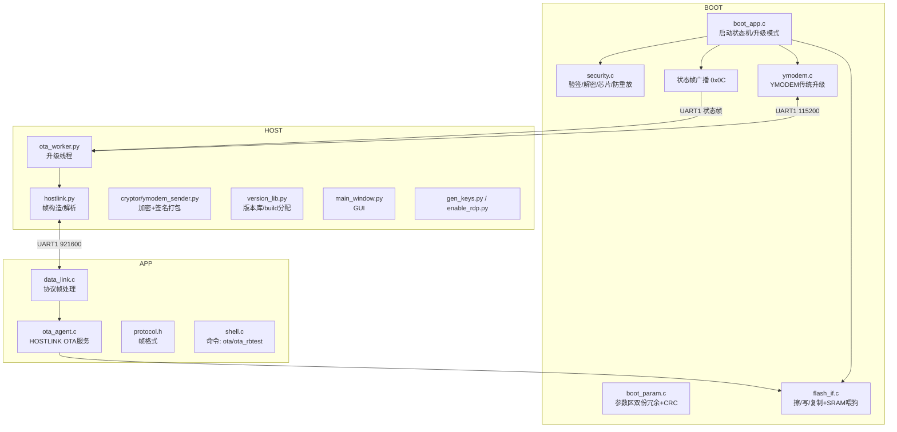
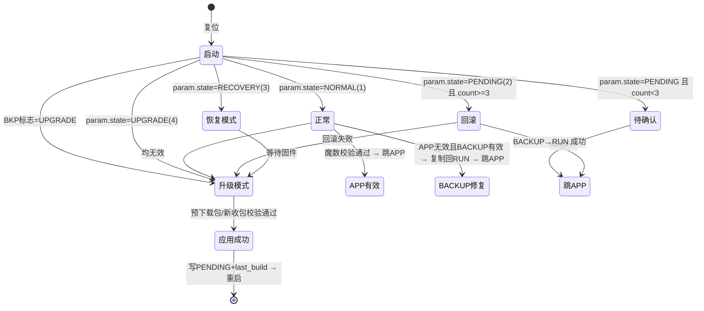
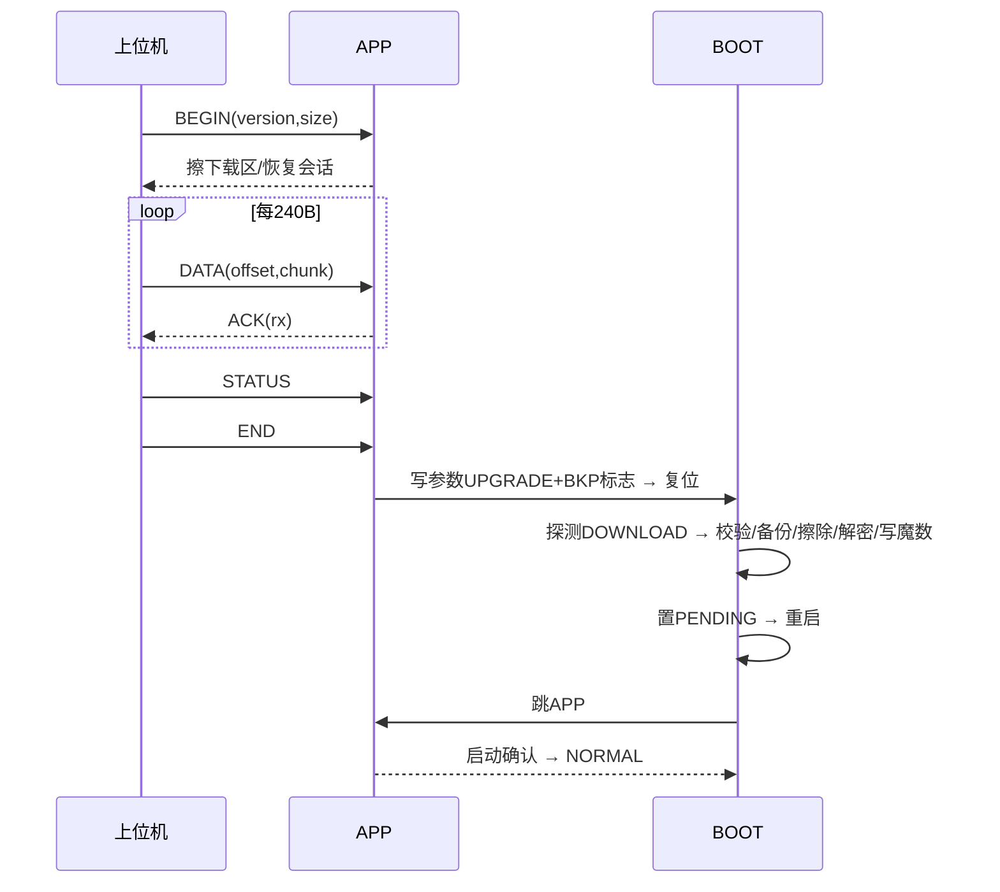

# D00 OTA 系统软件架构全貌

> 定位：STM32F407ZGT6 + FreeRTOS 上的工业级固件升级系统（BOOT + APP + 上位机三端）。
> 本文档为最终架构快照，配套 [问题复盘日志](ENGINEERING_LOG.md)（12.x 各节）。

---

## 1. 系统总览

| 能力 | 状态 |
| --- | --- |
| A/B 双区 + BACKUP 备份 + 启动确认 | ✅ 实机闭环 |
| 回滚状态机（PENDING 超限 / RECOVERY / BACKUP 自动修复） | ✅ 实机闭环 |
| 运行时 OTA（HOSTLINK，业务不中断） | ✅ 实机闭环 |
| 预下载镜像直通切换 | ✅ 实机闭环 |
| 跨复位断点续传 | ✅ 实机闭环 |
| 断电注入全生命周期（4 阶段） | ✅ 全部实测通过 |
| 安全：ECDSA 签名 / AES-256-CTR / 芯片校验 / 防重放 / 防回滚 / 密钥轮换 | ✅ 实机闭环 |
| BOOT 状态帧实时回传（上位机真实阶段可视化） | ✅ 实机闭环 |
| 上位机：版本库 / 批量 / 阶段流程条 / 彩色日志 | ✅ 单设备实机 + 批量逻辑验证 |
| RDP 读保护 | 🟡 脚本就绪，发布前实机验证 |

---

## 2. Flash 分区布局（1MB）

```text
0x08000000 +-------------------+  64KB  扇区0-1   BOOT（启动加载器）
           |      BOOT         |
0x08010000 +-------------------+  320KB 扇区4-6   RUN（APP 运行区）
           |       RUN         |
0x08060000 +-------------------+  384KB 扇区7-9   BACKUP（上一版固件，回滚源）
           |      BACKUP       |
0x080C0000 +-------------------+  128KB 扇区10    DOWNLOAD（下载暂存）
           |  DOWNLOAD(112KB)  |
0x080DF000 +-------------------+  16KB          会话槽区（512槽×32B，断点续传）
0x080E0000 +-------------------+  128KB 扇区11    PARAM（参数区）
           |  slot0 @0x080E0000 |
           |  slot1 @0x080E0400 |
           +-------------------+
```

**分区要点**
- RUN 尾部 `0x0804FFF8`：有效魔数 `0x4F54412E`；`0x0804FFFC`：版本号。
- PARAM 双份冗余（slot0/slot1，间距 1KB），CRC-32 只覆盖 `crc32` 字段之前的数据（避免自引用）。
- DOWNLOAD 尾部 16KB 为会话槽区：`magic 0x4F54414D + version + total + received + crc32`，每块精确记录进度。

---

## 3. 模块架构



---

## 4. BOOT 启动状态机



**升级模式内部（`boot_apply_download`）**
1. 探测 DOWNLOAD 包头（`magic==0x4F5441FE` 且大小合理）→ 直通应用；无包才回退 YMODEM。
2. 校验：芯片 `chip_id`、防重放 `build_no>last_build_no`、SHA256+ECDSA 签名、版本防回滚。
3. 备份：RUN→BACKUP（有效时）。
4. 擦除 RUN → AES-CTR 解密写入。
5. 写魔数/版本 → 参数区置 PENDING+count=1 → 状态帧广播 → 重启。
6. 校验失败 → 归一化参数后跳回 APP（支持断点续传/重新下载），不卡升级模式。

---

## 5. 核心功能原理

### 5.1 A/B 双区 + 启动确认
- 新固件写入 RUN 后置 `PENDING`；BOOT 每次启动 count++ 并跳 APP。
- APP 首次正常运行调 `ota_confirm_startup`：校验参数有效且 PENDING → 写 `NORMAL`。
- 新固件崩溃/未确认 → BOOT 计数到 3 → 自动回滚 BACKUP。

### 5.2 回滚体系
- **主动回滚**：PENDING 超限 → BACKUP→RUN。
- **被动修复**：NORMAL 但 RUN 无效 → BACKUP 自动恢复。
- **恢复模式**：回滚超限（`rollback_count>=MAX`）→ 等待强制重刷。

### 5.3 运行时 OTA（HOSTLINK）
- APP 运行期间经 UART1(921600) 接收 `BEGIN/DATA/STATUS/END`，块写入 DOWNLOAD（业务不中断）。
- `END` 后写参数 UPGRADE + BKP 标志 → 复位 → BOOT 探测预下载包直通切换。

### 5.4 跨复位断点续传
- 会话槽区每块精确记录 `received`（512 槽）；BEGIN 检测同版本会话 → 不擦除，从断点续传。
- 恢复路径重置 Flash 控制器状态（清错误标志+Unlock/Lock），避免续传写入 BSY 卡死。

### 5.5 防重放 / 防回滚 / 芯片校验
- `build_no` 严格递增（参数区持久化），同构建号包拒绝（`[SEC] Replay denied`）。
- `version` 只升不降（`[SEC] Rollback denied`）。
- `chip_id` 必须等于 `DBGMCU->IDCODE & 0xFFF`（防跨芯片烧录）。

### 5.6 签名与加密
- 包格式：`ota_header_t(32B: magic/version/size/iv/chip_id/build_no) + AES-256-CTR 密文 + ECDSA P-256 签名(64B)`。
- AES 密钥由设备 UID 派生（与上位机一致）；签名私钥由上位机环境变量注入。
- 密钥轮换：BOOT 内置双公钥（新+LEGACY），过渡期后移除旧公钥。

### 5.7 断电保护（全生命周期实测）
| 断电点 | 恢复行为 | 验证 |
| --- | --- | --- |
| 下载中 | 会话槽续传 | ✅ |
| 备份后 | 重启重新应用 | ✅ |
| 擦除后 | RUN 空 → 重新应用 | ✅ |
| 写入后 | RUN 损坏 → 重新应用 / BACKUP 回滚 | ✅ |
| 提交后 | PENDING 持久化 → 启动确认 | ✅ |

### 5.8 状态帧回传
- BOOT 应用阶段经 UART1 广播 `0x0C` 帧（阶段+错误码+版本，临时切 921600）。
- 上位机解析 → 阶段流程条显示真实推进（VERIFY/BACKUP/ERASE/WRITE/COMMIT/DONE）。

### 5.9 看门狗
- BOOT IWDG 64 分频 ≈8.2s，Flash 长操作（擦/写/复制）在 SRAM 内喂狗（`.ramfunc`）。
- APP IWDG 4s + 任务级看门狗（SysMon）。

---

## 6. 升级方法与流程

### 6.1 方法一：HOSTLINK 运行时升级（推荐，业务不中断）


### 6.2 方法二：YMODEM 传统升级（BOOT 直接接收）
1. 触发：shell `ota` 命令 / BKP 标志 / 参数 UPGRADE → BOOT 升级模式。
2. BOOT 擦 DOWNLOAD → 经 UART1(115200) 接收 YMODEM 包 → 校验/备份/解密/写 RUN → 置 PENDING → 重启。
3. 适用：APP 无法启动时的救援路径（配合 BOOT0+UART 烧录恢复）。

### 6.3 操作步骤（上位机）
1. 版本库刷新选择固件版本（自动填文件/版本号）。
2. 串口 COM13 / 921600，私钥环境变量 `OTA_PRIVKEY` 注入。
3. 打开串口 → 开始升级 → 观察阶段流程条 + BOOT 状态帧日志。
4. 批量：端口逗号分隔，串行预分配 build_no 后并发升级。

---

## 7. 安全模型

```text
可信根: BOOT(固化公钥) → 验证 APP 签名
传输:    固件包 AES-CTR 加密 + ECDSA 签名（双重保护）
防提取:  RDP Level 1（发布前启用）
防重放:  build_no 递增（参数区持久化）
防回滚:  version 递增 + 密钥轮换
防篡改:  芯片 ID 绑定 + 参数区 CRC
```

---

## 8. 测试验证记录（全部实机）

| 项目 | 结果 |
| --- | --- |
| HOSTLINK 运行时升级 | v13→v69 连续多轮成功 |
| YMODEM 传统升级 | 成功（含新包头兼容） |
| 回滚（PENDING 超限） | `[RB] erase=1 copy=1` 成功 |
| 防重放 | `[SEC] Replay denied` |
| 芯片校验 | `[SEC] Chip mismatch` 拒绝 |
| 断点续传 | 32160/64192 断点续传成功 |
| 断电注入 4 阶段 | 全部自动恢复 |
| 密钥轮换 | 旧/新公钥包均验证 |
| BOOT/APP 编译 | Keil 0 Error / 0 Warning |

---

## 9. 已知边界（诚实记录）

- RDP 仅脚本化，发布前需实机验证（启用后 DAP 无法读 Flash）。
- 启动早期擦参数扇区 BSY 卡死的寄存器级机制为"证据充分的推测"（已架构规避）。
- 批量升级要求同批次设备 UID 一致（AES 密钥由 UID 派生）。
- BACKUP 仅保留上一版（无 N-2 级回滚）。

---

## 10. 复盘索引

对应 [ENGINEERING_LOG.md](ENGINEERING_LOG.md) 章节：
- 12.9~12.10：BKP 索引 / 参数 CRC / SOP 残留
- 12.11：flash_copy_raw PSIZE（PGPERR）
- 12.12：运行时 OTA 直通
- 12.16：元数据 + 防重放
- 12.17 / 12.21：启动早期擦除卡死根治
- 12.22：跨复位断点续传
- 12.24~12.26：状态帧 / SWD 阻塞根因 / RDP 脚本
- 12.27~12.28：密钥轮换 / 断电注入
- 12.31：上位机实机操作
