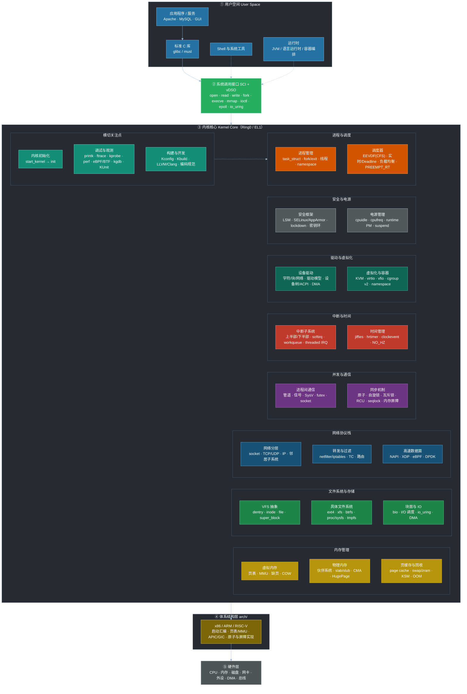

# Linux 内核知识结构图（顶级版）

> 一站式地图：总览图 → 源码目录地图 → 子系统速查 → 学习路径 → 工具链
> 在 VS Code 中按 `Ctrl+Shift+V` 预览渲染效果。

## 一、总览图

## 二、内核源码目录地图（知识 → 代码）

| 知识领域 | 源码目录 | 关键文件 / 入口 |
| --- | --- | --- |
| 进程 / 调度 | `kernel/` | `kernel/fork.c` · `kernel/sched/core.c` · `kernel/sched/fair.c` |
| 内存管理 | `mm/` | `mm/mmap.c` · `mm/page_alloc.c` · `mm/slab.c` · `mm/vmscan.c` |
| 文件系统 | `fs/` | `fs/open.c` · `fs/read_write.c` · `fs/dcache.c` · `fs/ext4/` |
| 网络协议栈 | `net/` | `net/socket.c` · `net/ipv4/` · `net/core/` · `net/netfilter/` |
| 驱动模型 | `drivers/` + `include/linux/` | `drivers/base/` · `drivers/base/platform.c` |
| 中断 / 时间 | `kernel/irq/` + `kernel/time/` | `kernel/irq/chip.c` · `kernel/time/hrtimer.c` |
| IPC | `ipc/` + `kernel/` | `ipc/shm.c` · `ipc/msg.c` · `ipc/sem.c` · `kernel/futex.c` |
| 同步机制 | `kernel/locking/` + `include/linux/` | `include/linux/spinlock.h` · `kernel/locking/mutex.c` · `kernel/rcu/` |
| 虚拟化 / 容器 | `virt/` + `kernel/` | `virt/kvm/` · `drivers/virtio/` · `kernel/cgroup/` |
| 安全 | `security/` | `security/security.c` · `security/lsm/` |
| 体系结构 | `arch/` | `arch/x86/kernel/` · `arch/arm64/` · `arch/riscv/` |
| 通用头文件 | `include/` | `include/linux/` · `include/uapi/` |
| 工具 / 测试 | `tools/` | `tools/perf/` · `tools/testing/selftests/` |

## 三、子系统速查表

| 子系统 | 核心概念 | 必读入口 |
| --- | --- | --- |
| 调度 | task_struct · sched_class · EEVDF 虚拟运行时间 · runqueue | `kernel/sched/fair.c` |
| 内存 | 4 级页表 · 伙伴系统 order · slab 缓存 · LRU 回收 | `mm/page_alloc.c` |
| 文件 | path → dentry → inode → file · 页缓存 xarray | `fs/dcache.c` |
| 网络 | sk_buff · 协议分用 · softirq NET_RX | `net/core/skbuff.c` |
| 同步 | 原子(单指令) / 自旋(短临界区) / 互斥(可睡眠) / RCU(读多写少) | `Documentation/locking/` |
| 中断 | 上下半部拆分：顶半部快、底半部延后 | `kernel/irq/manage.c` |

## 四、学习路径

1. **地基**：C 语言 + 常用内核数据结构（链表 / 红黑树 / xarray / maple tree）
2. **进程与调度**：生命周期 → EEVDF 调度原理 → 线程与 namespace
3. **内存管理**：虚拟地址空间 → 页表 → 伙伴系统/slab → 缺页异常与回收
4. **同步机制**：原子/自旋/互斥/RCU 的适用场景（并发编程的地基）
5. **文件系统 + 块层**：VFS 抽象 → ext4 → 页缓存回写 → io_uring
6. **网络栈**：socket 层 → TCP/IP → netfilter → NAPI/XDP
7. **中断与时间**：上下半部 → workqueue → hrtimer → NO_HZ
8. **驱动开发**：驱动模型 → 设备树/ACPI → DMA → 中断
9. **观测利器**：ftrace / kprobe / perf / eBPF 深入内核行为

## 五、观测工具链

| 场景 | 工具 | 一句话用法 |
| --- | --- | --- |
| 函数调用追踪 | ftrace | `echo function > current_tracer` 后读 trace |
| 动态插桩 | kprobe / uprobe | 运行时探测任意函数入口/出口 |
| 内核级编程 | eBPF | bpftrace/BCC 写脚本观测系统调用、延迟、锁 |
| 性能剖析 | perf | `perf record -g` + `perf report` 出火焰图 |
| 崩溃分析 | kdump / crash | 内核 panic 后离线分析内存转储 |
| 回归测试 | KUnit / kselftest | 内核单元测试与自测套件 |
